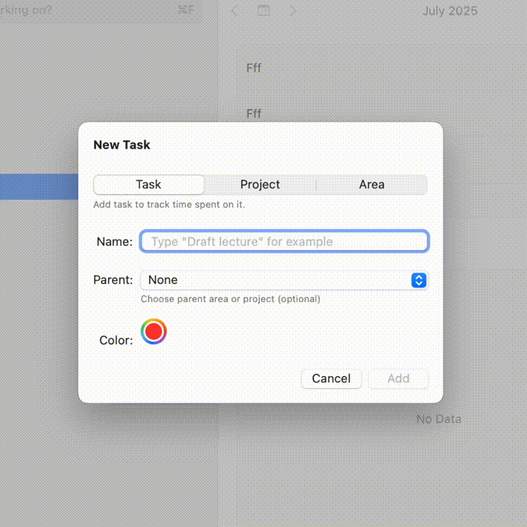

# SemanticColorPicker

A SwiftUI component that lets you select semantic color tokens—custom identifiers that map to adaptive, theme-aware `Color` values—instead of picking raw RGB colors.

[](https://github.com/borisovodov/SemanticColorPicker/actions/workflows/workflow.yaml)
[](https://codecov.io/gh/borisovodov/SemanticColorPicker)
[](https://swiftpackageindex.com/borisovodov/SemanticColorPicker)
[](https://swiftpackageindex.com/borisovodov/SemanticColorPicker)



## Overview

`SemanticColorPicker` is a SwiftUI control that displays a color well for a selected semantic color token and provides a grid-based selector for choosing from a predefined set of tokens. Unlike SwiftUI’s native `ColorPicker`, this package binds to types conforming to `ColorConvertible`, enabling theme-aware, environment-adaptive colors across all Apple platforms.

Package also contains:
* `ColorConvertible` protocol, which allows you to define custom color types that can be used with the `SemanticColorPicker`.
* A default implementation of `ColorConvertible` using the `SemanticColor` enum, which includes common semantic colors like `.red`, `.blue`, etc., and their opacity variants.

## Installation

Add next row in your `Package.swift` file `dependencies` section:

```swift
.package(url: "https://github.com/borisovodov/SemanticColorPicker.git", from: "2.0.0")
```

Alternatively you can add package dependency in Xcode. For that open `.xcproject` file → click `PROJECT` → `Package Dependencies` → `+` → type `https://github.com/borisovodov/SemanticColorPicker` in the search field → click `Add Package`. See the Xcode [documentation](https://developer.apple.com/documentation/xcode/adding-package-dependencies-to-your-app) for details.

Then import the package:

```swift
import SemanticColorPicker
```

## Usage

Use `SemanticColorPicker` in your SwiftUI view:

```swift
import SwiftUI
import SemanticColorPicker

struct ThemeSettingsView: View {
    @State private var selectedColor: SemanticColor = .blue

    var body: some View {
        SemanticColorPicker("Accent Color", data: SemanticColor.allCases, selection: $selectedColor)
            .padding()
    }
}
```

Or with a custom data type:

```swift
struct Tag: Identifiable, ColorConvertible {
    let id: UUID = UUID()
    let color: Color
    let description: String
}

let tags: [Tag] = [
    .init(color: Color.red, description: "Red"),
    .init(color: Color.blue, description: "Blue"),
    .init(color: Color.green, description: "Green")
]

struct ContentView: View {
    @State private var selectedTag: Tag = tags[0]

    var body: some View {
        SemanticColorPicker(data: tags, selection: $selectedTag) {
            Text("Select Tag Color")
        }
        .padding()
    }
}
```

> [!NOTE]
> `SemanticColor` is a convenient default implementation, but you can use any custom type that conforms to the `ColorConvertible` protocol. If `SemanticColor` doesn't fit your needs or you want more control over your color system, simply create your own type as shown in the `Tag` example above.

### Extending the Color Palette

The `SemanticColor` struct is extensible. You can create custom colors and combine them with the predefined palette.

Define your custom colors as static properties:

```swift
import SemanticColorPicker

extension SemanticColor {
    static let gray = SemanticColor(
        id: "gray",
        description: "Gray Color",
        color: .gray
    )
}
```

Create a custom palette by combining standard colors with custom ones:

```swift
let palette = SemanticColor.allCases + [
    SemanticColor.gray,
]
```

Combine predefined colors with your custom ones:

```swift
struct ContentView: View {
    @State private var selectedColor: SemanticColor = .blue

    var body: some View {
        SemanticColorPicker(
            "Theme Color",
            data: palette,
            selection: $selectedColor
        )
        .padding()
    }
}
```

### Encoding and Decoding with Custom Colors

When using `Codable` with custom colors, you need to provide a palette to the encoder and decoder so they can properly serialize and deserialize your custom colors.

#### Basic Example

```swift
import Foundation
import SemanticColorPicker

// Define custom colors
extension SemanticColor {
    static let gray = SemanticColor(
        id: "gray",
        description: "Gray Color",
        color: .gray
    )
}

// Your Codable model
struct UserSettings: Codable {
    var accentColor: SemanticColor
}

// Create a custom palette including your custom colors
let customPalette = SemanticColor.allCases + [.gray]

// Encoding
let settings = UserSettings(accentColor: .gray)
let encoder = JSONEncoder()
encoder.userInfo[SemanticColor.paletteKey] = customPalette
let data = try encoder.encode(settings)

// Decoding
let decoder = JSONDecoder()
decoder.userInfo[SemanticColor.paletteKey] = customPalette
let decoded = try decoder.decode(UserSettings.self, from: data)
```

> [!IMPORTANT]
> If you don't provide a palette via `userInfo`, decoding will throw a `SemanticColor.DecodingError.colorNotFound` error if a custom color is encountered. Always use the same palette for encoding and decoding to ensure color fidelity.
